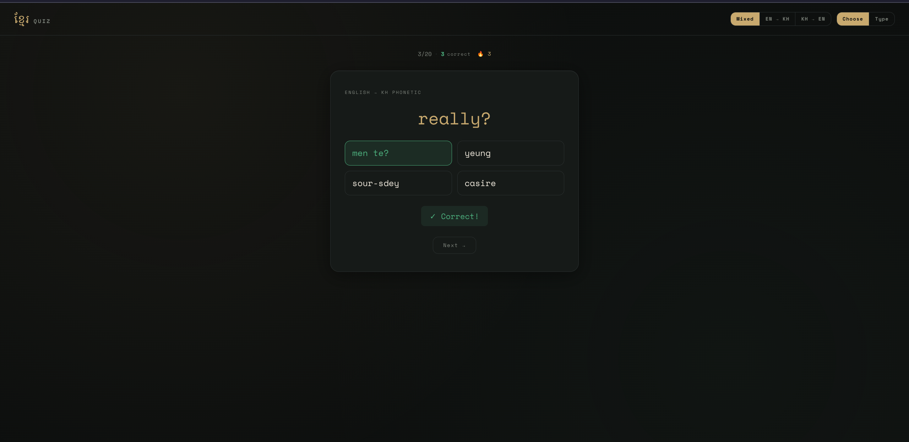

# ខ្មែរ Khmer Quiz

A personal web app I built to help me study Khmer (Cambodian) vocabulary.

**Live:** [learn.khmer.cloud](https://learn.khmer.cloud)



## Why I Built It

I use Anki and this works, but I fetl that I need another method to help me learn and I'd also like other people to use it help them learn also. It's a simple quiz loop where I can drill words in both directions (English → Khmer phonetic and vice versa), switch between multiple choice and typed input, and see a streak counter to stay motivated. I also wanted to be able to manage the word list from a browser without editing flat files.

## What It Does

**Quiz interface**
- 20-question rounds with a score and streak counter.
- Two answer modes: multiple choice (4 options) or typed input.
- Three direction modes: English → Khmer, Khmer → English, or random mix.
- Spacebar advances to the next question.
- Results screen at the end of each round.

**Admin panel** (`/admin`)
- View, filter, add, edit, and delete vocab entries.
- Toggle words active/inactive (inactive words are excluded from quizzes).
- Fields: English, Khmer phonetic, notes, category.

**Vocab import script**
- `scripts/import_vocab.py` imports a tab-separated Anki export.
- Idempotent - skips duplicates on re-run.
- Strips HTML tags that Anki includes in exports.

**Stats tracking**
- Every answer (correct or not) is recorded in a `quiz_results` table with session ID, direction, and mode - groundwork for future review/spaced-repetition features.

## Stack

| Layer | Technology |
|---|---|
| Backend | Python / Flask |
| Database | PostgreSQL 16 |
| Frontend | Vanilla JS, no framework |
| Fonts | Noto Serif Khmer, Space Mono, Instrument Serif |
| Deployment | Docker Compose, self-hosted |

## Project Structure

```
├── app/
│   ├── app.py              # Flask app - all routes
│   ├── Dockerfile
│   ├── requirements.txt
│   ├── static/
│   │   ├── css/style.css   # Quiz UI styles
│   │   └── css/admin.css   # Admin panel styles
│   │   ├── js/quiz.js      # Quiz logic
│   │   └── js/admin.js     # Admin CRUD
│   └── templates/
│       ├── index.html      # Quiz page
│       └── admin.html      # Admin page
├── db/
│   └── init.sql            # Schema (vocab, quiz_results, users stub)
├── scripts/
│   └── import_vocab.py     # Anki .txt importer
├── compose.yaml
└── .env.example
```

## Roadmap

- **User accounts:** Register/login so each user can track their own scores and quiz history over time.
- **Khmer script alongside phonetics:** Currently the quiz uses phonetic romanization only. I plan to display the actual Khmer script (e.g. ស្វាគមន៍) alongside so learners can connect the two.
- **Improved phonetics and definitions:** Clean up the existing entries to be more consistent and readable, especially for the typed input mode.
- **Category-based quizzes:** Let users choose a category to focus on (nouns, verbs, greetings, numbers, etc.) rather than always pulling from the full word list.

## Notes

- No authentication on the admin panel. This runs on a private home server behind a firewall, so it's not a concern for me.
- The `users` table in the schema is a stub for future multi-user support that I haven't needed yet.
- Multiple choice answer validation happens server-side (answer stored in Flask session); typed answer validation is client-side since it's a personal tool and there's nothing to gain from hiding it.

---
